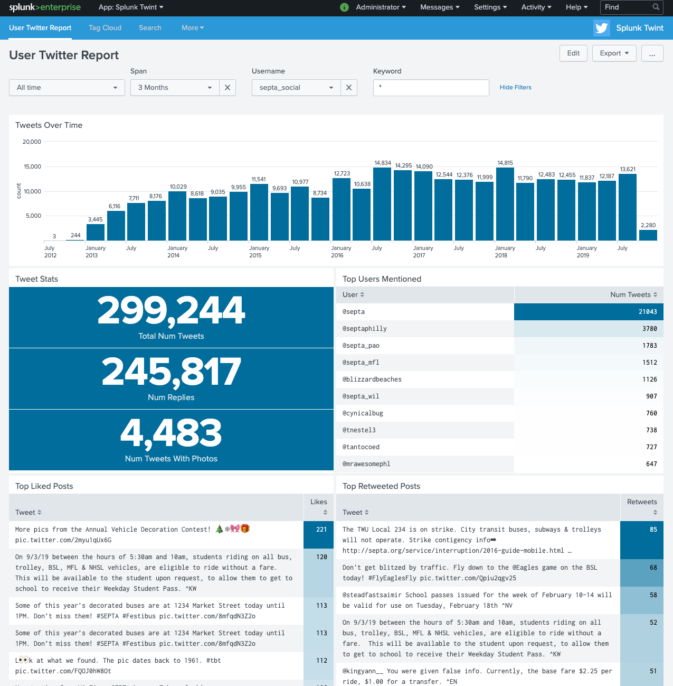
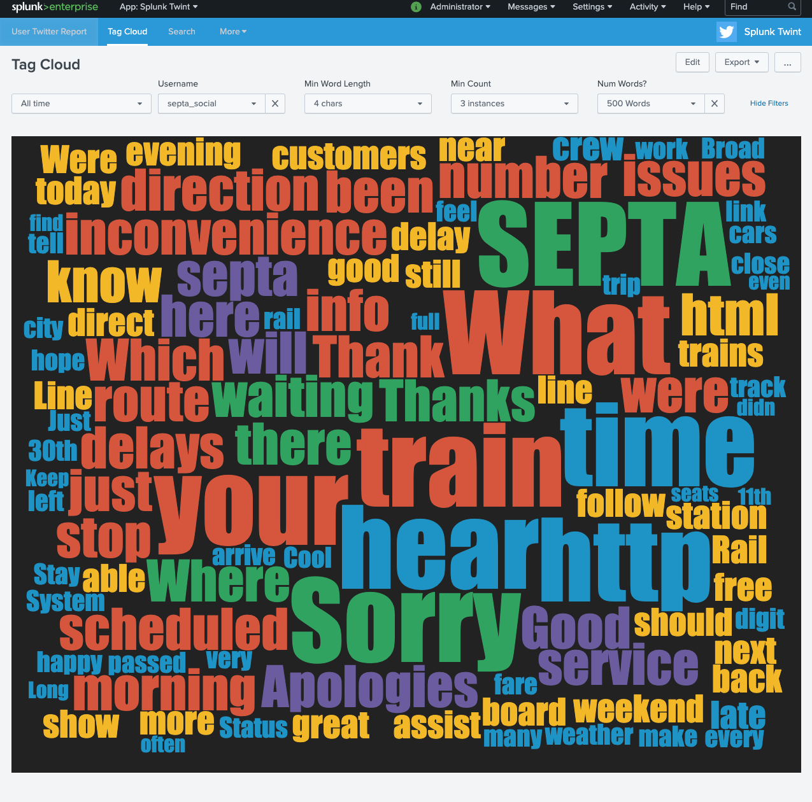

# Splunk Twint

Depending how you count, this repo is a few different things:

- A Dockerized version of <a href="https://github.com/twintproject/twint">Twint</a>
- A series of shell scripts which wrap the Dockerized version of Twint to allow user timelines to be downloaded with checkpoints.
- A Dockerized version of Splunk <a href="https://www.splunk.com/">Splunk</a> to ingest downloaded tweets
and search through Twitter timelines as well as display some dashbaords.

Screenshots:

## Quick and Dirty Usage

You don't even need to clone the repo for these:
- This command uses the `twint-user` helper script and does the same, except tweets will be written in JSON format to `logs/user/dmuth/` and a resume file will automatically be used:
   - `bash <(curl -s https://raw.githubusercontent.com/dmuth/twint-splunk/master/twint-user) dmuth --year 2020 --since 2019-01-01`
   - When the command completes a file with the suffix `.done` will be written next to the log so that if the command is re-run with the same parameters, the download will be skipped.
- Download 5 years of tweets with `twint-user-by-year`:
   - `bash <(curl -s https://raw.githubusercontent.com/dmuth/twint-splunk/master/twint-user-by-year) dmuth 2010 2014`

## Regular Usage

First, clone the repo. :-)

Now, you can run `./twint` which is a Docker wrapper for my twint-lite build.
- Get every tweet I made in 2019:
   - `bash <(curl -s https://raw.githubusercontent.com/dmuth/twint-splunk/master/
twint -u dmuth -o tweets.txt --resume resume-user-dmuth.txt --since 2019-01-01 until 2020-01-01`

### Advanced Usage

If you want to download multiple Twitter timelines or a very busy user's timeline,
please check out more detailed instructions in <a href="HOW-TO-DOWNLOAD-MANY-TWEETS.md">HOW-TO-DOWNLOAD-MANY-TWEETS.md</a>.

#### "Twint-lite"

In a few places, the term "twint-lite" is referenced.  If you look in 
<a href="Dockerfile-lite#L20">the Dockerfile around line 20</a>, you'll see that I wrote
a series of `sed` commands to remove refernces to the `pandas` module.  I have no issues
with that module per se, but its presence was causing builds to take upwards of 10-15 minutes
on my machine.  Removing references to it sped up builds of the Docker image to be around 30 seconds,
without breaking the core functionality of pulling Twitter timelines.

Or, to paraphrase Adam Savage, I rejected the reality and substituted my own. :-)

## Development

- Twint Docker Management:
   - `./bin/build.sh [ full ]` - Build Docker image. For all scripts where `full` is available, if it is speicfied as the first argument, the full (with Pandas) verison will be built.  Otherwise, the Lite version will be built.
   - `./bin/devel.sh [ full ]` - Build Docker image and spawn interactive shell.
   - `./bin/push.sh [ full ]` - Push Docker image to Docker Hub.
   - `./bin/pull.sh [ full ]` - Pull Docker image from Docker Hub.
   - `./bin/run.sh [ full ] args` - Run for production use. Additional args should be passed in on the command line.
- Splunk Management:
   - `./bin/splunk-start.sh [ --devel ]` - Start a Splunk instance at <a href="https://localhost:8000">https://localhost:8000/</a>.  Just follow the instructions on configuring Splunk. Use `--devel` if you want an interactive shell opened in the container.
   - `./bin/splunk-stop.sh` - Kill the Splunk instance

## Bugs/TODO

- If you try writing a file to a directory that is not under the current directory, Docker will likely have path issues.

## Credits

- <a href="https://github.com/twintproject/twint">Twint</a> - The ability to download an entire timeline without having to use Twitter's overly restrctive API is amazing!
- <a href="http://www.splunk.com/">Splunk</a>, for having such a fantastic product which is also a great example of Operational Excellence!
- <a href="http://patorjk.com/software/taag/#p=display&h=0&v=0&f=Standard&t=Splunk%20Lab">This text to ASCII art generator</a>, for the logo I used in the script.

# Contact

My email is doug.muth@gmail.com.  I am also <a href="http://twitter.com/dmuth">@dmuth on Twitter</a> 
and <a href="http://facebook.com/dmuth">Facebook</a>!

