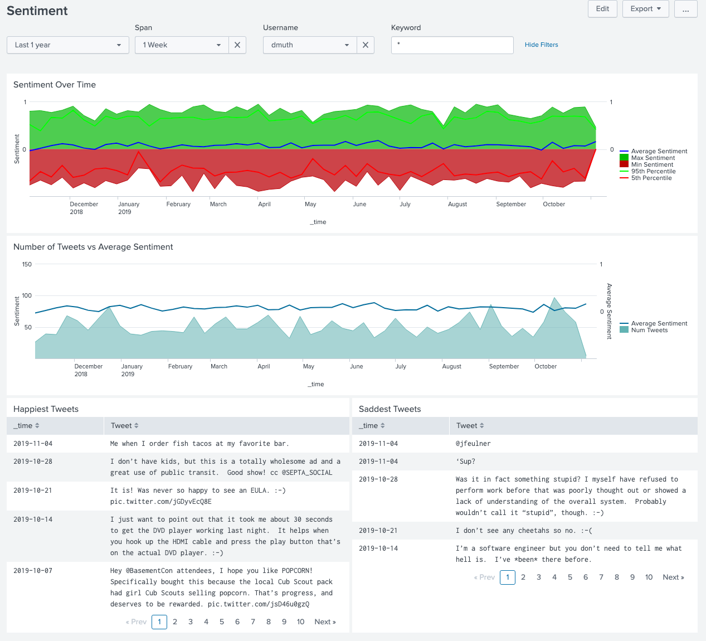

# Splunk Twint

Depending how you count, this repo is a few different things:

- A Dockerized version of <a href="https://github.com/twintproject/twint">Twint</a>
- A series of shell scripts which wrap the Dockerized version of Twint to allow user timelines to be downloaded with checkpoints.
- A Dockerized version of <a href="https://www.splunk.com/">Splunk</a> to ingest downloaded tweets
and search through Twitter timelines as well as display some dashbaords.

Screenshots:

## Quick and Dirty Usage

You don't even need to clone the repo for this one:

- `bash <(curl -s https://raw.githubusercontent.com/twintproject/twint-splunk/master/twint ) -u dmuth --year 2020 --since 2019-01-01`
   - All tweets I made from 2019.

For these, you'll need to clone the repo with `git clone https://github.com/dmuth/splunk-twint.git` and then run these on the command line:

- `./twint-user dmuth --year 2020 --since 2019-01-01`
   - Uses the `twint-user` helper script and does the same as above, except tweets will be written in JSON format to `logs/user/dmuth/` and a resume file will automatically be used:
   - When the command completes a file with the suffix `.done` will be written next to the log so that if the command is re-run with the same parameters, the download will be skipped.
- `./twint-user-by-year dmuth 2010 2014 -o tweets.csv`
   - Download 5 years of tweets and write them to `logs/user/dmuth/` in JSON format.
   - If interrupted, downloads will resume where they left off and previous years will not be re-downloaded.
- `./twint-geo 40.4442902 -79.9948067 1mi anthrocon-2019 --since 2019-07-01 --until 2019-07-10`
   - Download tweets within a mile of <a href="https://pittsburgh.cbslocal.com/2019/07/04/anthrocon-2019-kicks-off-in-downtown-pittsburgh/">Anthrocon 2019</a> and write them to the file `logs/location/anthrocon-2019.json`.
   - If interrupted, downloads will resume where they left off and previous runs will not be re-downloaded.

### Advanced Usage

If you want to download multiple Twitter timelines or a very busy user's timeline,
please check out more detailed instructions in <a href="HOW-TO-DOWNLOAD-MANY-TWEETS.md">HOW-TO-DOWNLOAD-MANY-TWEETS.md</a>.

#### "Twint-lite"

In a few places, the term "twint-lite" is referenced.  If you look in 
<a href="Dockerfile-lite#L20">the Dockerfile around line 20</a>, you'll see that I wrote
a series of `sed` commands to remove refernces to the `pandas` module.  I have no issues
with that module per se, but its presence was causing builds to take upwards of 10-15 minutes
on my machine.  Removing references to it sped up builds of the Docker image to be around 30 seconds,
without breaking the core functionality of pulling Twitter timelines.

Or, to paraphrase Adam Savage, I rejected the reality and substituted my own. :-)

#### Running Python scripts in Splunk

The Twint CLI is just a wrapper for the Twint Python module.  The module can be 
accessed its from Python scripts.  The syntax for running a Python script is as follows:

`twint --run-python-script /path/to/python-script [args for Python script]`

The following directories will be exported to the Docker container:

- `/python-scripts/` - Where the script resides.  Make sure all required libraries are local to that script.
- `/mnt/` - The directory the `twint` wrapper is executed from.

If the Python scripts write files, they should do so to either of those two directories.

Example scripts that you can run with this app:

- `./twint --run-python-script ./python-scripts/hello.py` - Hello World!
- `./twint --run-python-script ./python-scripts/get-user-info.py dmuth` - Get user info for `dmuth`
- `./twint --run-python-script ./python-scripts/get-user-tweets.py dmuth` - Get 20 recent tweets for `dmuth`
- `TWINT_TIMEOUT=10 ./twint --run-python-script ./python-scripts/get-user-following.py dmuth` 
   - Get 20 users `dmuth` is following and set a timeout of 10 seconds for each fetch.  This does not mean 10 seconds for the entire script, but rather a timeout for _any_ read of Twitter.  This is helpful for when Twitter is slow and you'd rather your script time out sooner rather than later.

Configuration options for the twint module can be found at https://github.com/twintproject/twint/wiki/Configuration

The <a href="https://www.sqlalchemy.org/">SQLAlchemy module</a> is installed for advanced interaction with SQLite databases that are created via Twint.

## Data Analytics in Splunk

<a href="https://www.splunk.com/">Splunk</a> is a fantastic data analytics platform which just happens to 
ship with a free tier!  You can ingest up to 500 MB of data per day into Splunk free of charge.
To that end, I wrote a Dockerized version of Splunk called
<a href="https://github.com/dmuth/splunk-lab">Splunk Lab</a>, which can be used to quickly spin up
an instance of Splunk and ingest data.  

Here's how to get started:
   - `./bin/splunk-start.sh` - Start an instance of Splunk Lab in a Docker container.  The welcome screen will display the default login and password, and they can be modified before continuing.  Once Splunk Lab is started, go to <a href="https://localhost:8000">https://localhost:8000/</a>, log in, and there will be some dashboards readily available.
   - `./bin/splunk-stop.sh` - Kill the Splunk instance

By default, data will be read from the directory `logs/`, so all tweets should be written under that directory.

## Development

- Twint Docker Management:
   - `./bin/build.sh [ full ]` - Build Docker image. For all scripts where `full` is available, if it is speicfied as the first argument, the full (with Pandas) verison will be built.  Otherwise, the Lite version will be built.
   - `./bin/devel.sh [ full ]` - Build Docker image and spawn interactive shell.
   - `./bin/push.sh [ full ]` - Push Docker image to Docker Hub.
   - `./bin/pull.sh [ full ]` - Pull Docker image from Docker Hub.
   - `./bin/run.sh [ full ] args` - Run for production use. Additional args should be passed in on the command line.
- Splunk Management:
   - `./bin/splunk-start.sh --devel` - Start Splunk Lab in an interactive shell.  Exiting the shell will terminate the Splunk Lab container.

## Bugs/TODO

- If you try writing a file to a directory that is not under the current directory, Docker will likely have path issues.
- Support downloads on a monthly basis once the bug I found in Twint is fixed.
- Write a script to allow tweets within a set of coordinates.
- Build a dashboard to display tweets on a map.
- Use the Sentiment Analysis module to gauge sentiment over time and build tag clouds of positive/negative tweets.

## Credits

- <a href="https://github.com/twintproject/twint">Twint</a> - The ability to download an entire timeline without having to use Twitter's overly restrctive API is amazing!
- <a href="http://www.splunk.com/">Splunk</a>, for having such a fantastic product which is also a great example of Operational Excellence!
- <a href="http://patorjk.com/software/taag/#p=display&h=0&v=0&f=Standard&t=Splunk%20Lab">This text to ASCII art generator</a>, for the logo I used in the script.

# Contact

My email is doug.muth@gmail.com.  I am also <a href="http://twitter.com/dmuth">@dmuth on Twitter</a> 
and <a href="http://facebook.com/dmuth">Facebook</a>!

